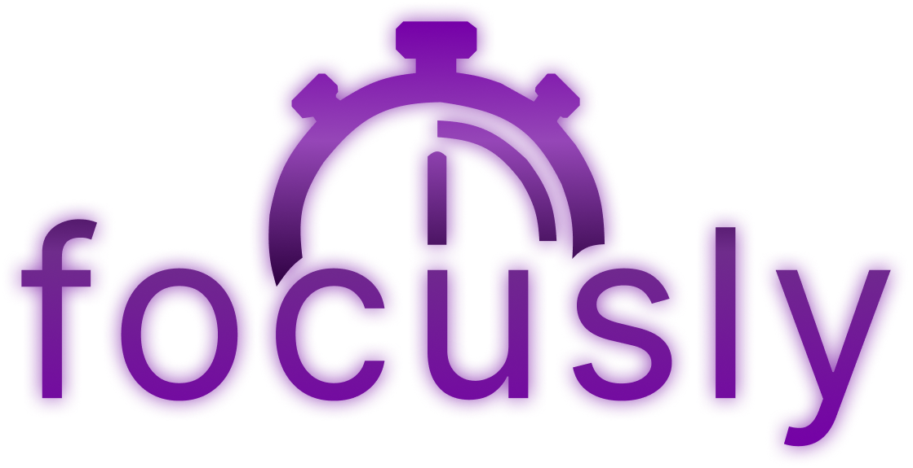

<p align="center">
  
</p>

<h1 align="center">Focusly</h1>

<p align="center">
  <strong>Your Personal Pomodoro Study Companion 🎯</strong>
</p>

<p align="center">
  
  
  
  
</p>

---

## 📖 Tentang Focusly

**Focusly** adalah aplikasi produktivitas dan Pomodoro timer yang dirancang untuk membantu mahasiswa dan pelajar tetap fokus saat belajar. Dengan antarmuka yang modern, animasi premium, dan sistem gamifikasi, Focusly membuat sesi belajar menjadi lebih menyenangkan dan terstruktur.

### ✨ Mengapa Focusly?

- 🎯 **Pomodoro Timer** — Teknik belajar terbukti efektif dengan sesi fokus + istirahat
- 🎮 **Gamifikasi** — Dapatkan energy points, naikkan rank dari Rookie ke Master
- 🧘 **Microritual** — Persiapan mental sebelum sesi belajar dimulai
- 📊 **Progress Tracking** — Pantau kemajuan setiap task yang sedang dikerjakan
- ✨ **Premium UI/UX** — Animasi smooth 60fps, glassmorphism, dan micro-interactions

---

## 🎨 Fitur Utama

### 📱 Screens & Flow

| Screen | Deskripsi |
|--------|-----------|
| **Splash Screen** | Breathing gradient + bounce-in logo animation |
| **Welcome Screen** | Onboarding dengan floating mascot dan glow button |
| **Personal Info** | Form input nama dengan animated focus ring |
| **Dashboard** | Grid task cards dengan shimmer loading dan scale-tap effect |
| **Add Task** | Form tambah task dengan priority slider dan subtask chips |
| **Session Confirm** | Konfirmasi sesi dengan animated progress bar |
| **Microritual** | Persiapan 1 menit sebelum fokus, dengan pulse timer |
| **Pomodoro Timer** | Circular timer ring dengan glow effect (custom painter) |
| **Break Session** | Timer istirahat dengan animasi yang lebih calm |
| **End Session** | Reward card dengan bounce-in animation dan count-up |
| **Profile** | Stats dengan animated count-up, rank badge, dan glow card |

### 🎭 Animasi & Micro-Interactions

- **Breathing Gradient** — Background gradient yang bergerak halus
- **Floating Widget** — Mascot bounce animation (idle)
- **Glow Button** — CTA button dengan pulsing glow shadow
- **Scale Tap Card** — Press-down + spring-back pada card
- **Pulse Timer** — Digit timer yang berdenyut setiap detik
- **Circular Timer Ring** — Custom painted ring dengan glow effect
- **Staggered Entrance** — Elemen muncul satu per satu dengan delay
- **Shimmer Loading** — Skeleton loading saat fetch data
- **Animated Progress Bar** — Smooth tween-based progress fill
- **Count-Up Animation** — Angka naik dari 0 ke nilai akhir
- **Bounce-In Badge** — Rank badge muncul dengan elastic curve

### 🏆 Sistem Gamifikasi

| Rank | Energy Points |
|------|---------------|
| 🥉 Rookie | 0 - 19 |
| 🥈 Adept | 20 - 39 |
| 🥇 Pro | 40 - 59 |
| 🏅 Master | 60+ |

Setiap sesi Pomodoro yang selesai memberikan **2 energy points**.

---

## 🛠️ Tech Stack

| Teknologi | Penggunaan |
|-----------|------------|
| **Flutter 3.10+** | Framework UI cross-platform |
| **Dart 3.10+** | Bahasa pemrograman |
| **SQLite (sqflite)** | Local database untuk tasks, sessions, dan user data |
| **Google Fonts** | Typography (Poppins) |
| **Custom Painters** | Circular timer ring dengan glow effect |
| **Built-in Animations** | AnimationController, TweenAnimationBuilder, CurvedAnimation |

> **Zero external animation packages** — Semua animasi menggunakan Flutter built-in APIs untuk performa 60fps maksimal.

---

## 📁 Struktur Projek

```
lib/
├── main.dart                    # Entry point + routing
├── theme.dart                   # Design system, colors, page transitions
├── data/
│   └── database.dart            # SQLite database layer (AppDb)
├── screens/
│   ├── splash_screen.dart       # Splash dengan breathing gradient
│   ├── welcome_screen.dart      # Onboarding screen
│   ├── personal_info_screen.dart # Form input nama
│   ├── main_apps_screen.dart    # Dashboard utama + task grid
│   ├── add_task_screen.dart     # Form tambah task
│   ├── confirm_session_screen.dart # Konfirmasi sesi
│   ├── microritual_screen.dart  # Pre-session ritual
│   ├── pomodoro_screen.dart     # Timer Pomodoro
│   ├── break_screen.dart        # Timer istirahat
│   ├── end_screen.dart          # Reward screen
│   └── profile_screen.dart      # Profil + rank
└── widgets/
    ├── logo.dart                # Logo widget
    └── animated_widgets.dart    # 11 reusable animation widgets
```

---

## 🚀 Cara Menjalankan

### Prerequisites

- Flutter SDK 3.10+ ([Install Flutter](https://docs.flutter.dev/get-started/install))
- Dart SDK 3.10+
- Android Studio / VS Code
- Chrome (untuk web) atau Android Emulator / Physical Device

### Setup & Run

```bash
# 1. Clone repository
git clone https://github.com/Zenqirtz/focusly.git
cd focusly

# 2. Install dependencies
flutter pub get

# 3. Jalankan aplikasi
flutter run -d chrome          # Web (Chrome)
flutter run -d edge            # Web (Edge)
flutter run -d windows         # Desktop Windows
flutter run                    # Pilih device interaktif
```

### Build

```bash
# Build APK (Android)
flutter build apk --release

# Build Web
flutter build web

# Build Windows
flutter build windows
```

---

## 🔄 Alur Aplikasi

```
Splash Screen
    │
    ▼
Welcome Screen ──→ Personal Info
                        │
                        ▼
                   Dashboard (Main Apps)
                    │          │
                    ▼          ▼
               Add Task    Select Task
                              │
                              ▼
                      Confirm Session
                              │
                              ▼
                       Microritual (1 min)
                              │
                              ▼
                      Pomodoro Timer (25 min)
                              │
                              ▼
                       Break Timer (5 min)
                              │
                              ▼
                      End Session + Reward
                              │
                              ▼
                     Back to Dashboard
```

---

## 🗃️ Database Schema

### Tables

| Table | Deskripsi |
|-------|-----------|
| `users` | Data pengguna (nama, nickname) |
| `tasks` | Daftar task/mata kuliah |
| `sessions` | Riwayat sesi Pomodoro |
| `task_subtasks` | Sub-task untuk setiap task |
| `session_subtasks` | Sub-task dalam sesi (dengan status done) |

---

## 👥 Kontributor

| Nama | Role |
|------|------|
| **Zenqirtz** | Developer |

---

## 📄 Lisensi

Projek ini dibuat untuk keperluan akademis.

---

<p align="center">
  <strong>Made with 💜 using Flutter</strong>
</p>
